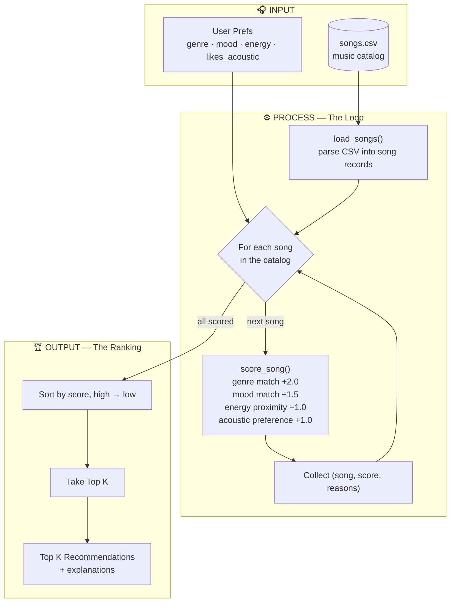

# 🎵 Music Recommender Simulation

## Project Summary

In this project you will build and explain a small music recommender system.

Your goal is to:

- Represent songs and a user "taste profile" as data
- Design a scoring rule that turns that data into recommendations
- Evaluate what your system gets right and wrong
- Reflect on how this mirrors real world AI recommenders

### How Real-World Recommendations Work

Real-world streaming platforms like Spotify and YouTube predict what you will enjoy next by blending two main techniques into a **hybrid system**:

- **Collaborative filtering** learns from other users' behavior — if people with similar tastes love a song, it recommends that song to you.
- **Content-based filtering** looks at the attributes of the songs themselves and finds more that match what you already like.

For this simulation, I will prioritize **content-based filtering**, because it works from a song's own features without needing a large crowd of users, it solves the "cold-start" problem for brand-new songs, and it produces recommendations that are easy to explain.

### Features Used in the Simulation

Each feature in the `UserProfile` is matched against the corresponding feature in the `Song`:

| `Song` feature | `UserProfile` feature | Type |
| --- | --- | --- |
| `genre` | `favorite_genre` | categorical (exact match) |
| `mood` | `favorite_mood` | categorical (exact match) |
| `energy` | `target_energy` | numeric 0–1 (proximity: closer = higher) |
| `acousticness` | `likes_acoustic` | numeric 0–1 vs. boolean preference |

---

## How The System Works

This is a **content-based** recommender. It compares the features of each song
against a user's taste profile, gives every song a score, and returns the
best-matching songs. It never needs other users' data, so it works even on a
brand-new catalog.

### Data Flow



- **Input** — the user's taste profile plus the raw `songs.csv` catalog.
- **Process (the loop)** — every song is scored individually against the profile
  using the four weighted rules, and each result is kept along with its score and
  reasons.
- **Output (the ranking)** — all scored songs are sorted highest-first and the
  top `K` are returned with explanations.

### Design Questions

**What features does each `Song` use in your system?**

- `genre` — style of music (categorical, e.g. pop, lofi, metal)
- `mood` — emotional feel (categorical, e.g. happy, chill, intense)
- `energy` — how intense/active the track is (numeric 0–1)
- `acousticness` — how acoustic vs. produced/electronic it is (numeric 0–1)
- (Also stored but not scored: `tempo_bpm`, `valence`, `danceability`, plus
  `id`, `title`, `artist`.)

**What information does your `UserProfile` store?**

- `favorite_genre` — the genre the user wants (matched to `Song.genre`)
- `favorite_mood` — the mood the user wants (matched to `Song.mood`)
- `target_energy` — the ideal energy level 0–1 (compared to `Song.energy`)
- `likes_acoustic` — a boolean preference for acoustic vs. produced music
  (compared to `Song.acousticness`)

**How does your `Recommender` compute a score for each song?**

- It adds up points from four rules: `score = genre + mood + energy + acoustic`
- **Genre match** — `+2.0` if the song's genre equals the user's favorite, else `0`
- **Mood match** — `+1.5` if the song's mood equals the user's favorite, else `0`
- **Energy proximity** — `+1.0 × (1 − |song.energy − target_energy|)`, so closer is
  worth more (an exact match earns the full point)
- **Acoustic preference** — if `likes_acoustic` is `True`, `+1.0 × acousticness`;
  if `False`, `+1.0 × (1 − acousticness)`
- Genre carries the most weight because it's the strongest signal of taste; the
  weights (`2.0 / 1.5 / 1.0 / 1.0`) are knobs you can tune (see *Experiments*).

**How do you choose which songs to recommend?**

- Score every song in the catalog, then sort by score from highest to lowest
- Return the top `K` (default `K = 5`)
- Each recommendation carries the reasons that earned its points, so the output is
  easy to explain

---

## Getting Started

### Setup

1. Create a virtual environment (optional but recommended):

   ```bash
   python -m venv .venv
   source .venv/bin/activate      # Mac or Linux
   .venv\Scripts\activate         # Windows

2. Install dependencies

```bash
pip install -r requirements.txt
```

3. Run the app:

```bash
python -m src.main
```

### Running Tests

Run the starter tests with:

```bash
pytest
```

You can add more tests in `tests/test_recommender.py`.

---

## Sample Recommendation Output

Paste a sample of your recommender's output here as a text block so a reader can see what it produces:

User profile: `genre=pop, mood=happy, energy=0.8, likes_acoustic=False`

```
Loading songs from data/songs.csv...
Loaded 18 songs.

============================================
  TOP RECOMMENDATIONS
============================================

1. Sunrise City — Neon Echo
   Score: 5.30
   Why:
     • matches your favorite genre (pop)
     • matches your mood (happy)
     • energy 0.82 vs target 0.80
     • produced sound (acousticness 0.18)

2. Gym Hero — Max Pulse
   Score: 3.82
   Why:
     • matches your favorite genre (pop)
     • energy 0.93 vs target 0.80
     • produced sound (acousticness 0.05)

3. Rooftop Lights — Indigo Parade
   Score: 3.11
   Why:
     • matches your mood (happy)
     • energy 0.76 vs target 0.80
     • produced sound (acousticness 0.35)

4. Concrete Kings — Rhyme Theory
   Score: 1.88
   Why:
     • energy 0.80 vs target 0.80
     • produced sound (acousticness 0.12)

5. Warehouse Pulse — Bassline Foundry
   Score: 1.82
   Why:
     • energy 0.95 vs target 0.80
     • produced sound (acousticness 0.03)
```

**Screenshot or video** *(optional)*: <!-- Insert a screenshot or demo video link here -->

---

## Experiments You Tried

Use this section to document the experiments you ran. For example:

- What happened when you changed the weight on genre from 2.0 to 0.5
- What happened when you added tempo or valence to the score
- How did your system behave for different types of users

### Reweighting: double energy, halve genre

I changed the scoring weights in `score_song` — genre from `2.0` to `1.0`
(halved) and the energy multiplier from `1.0` to `2.0` (doubled) — then re-ran
`main.py` to see whether recommendations got more accurate or just different.

**What happened:** the #1 pick stayed the same for all three real profiles
(Sunrise City, Library Rain, Storm Runner), because each of those songs wins on
genre *and* mood *and* energy at once, so reweighting can't dislodge them. The
change instead reshuffled ranks 2–5, consistently pulling energy-similar but
genre-mismatched songs upward:

| Profile | Notable shift | Read |
|---|---|---|
| High-Energy Pop | Storm Runner (rock) & Warehouse Pulse (edm) entered top 5 | Neither is pop or happy — surfaced purely for energy ≈ 0.90 |
| Chill Lofi | Spacewalk Thoughts (**ambient**) rose to #3, above Focus Flow (**actual lofi**) | A genre match got demoted below a non-lofi track |
| Deep Intense Rock | #3–5 became hip hop / edm / pop (all non-rock) | Energy proximity now outranks genre relevance |

**More accurate, or just different?** Just different — arguably slightly *less*
faithful to these profiles. Because each profile is named by genre ("...Pop",
"...Lofi", "...Rock"), boosting energy and cutting genre makes the lists drift
away from the stated genre identity. It's a legitimate design choice — the system
now favors "songs that feel the right intensity" over "songs of your genre" — but
it's a taste trade-off, not a measurable accuracy gain (there's no ground truth to
score against). What's clear is that energy match now beats genre match.

**Side effect:** the Out-of-Range Energy edge case got *worse*. Doubling the energy
multiplier doubled the penalty, so its scores fell from about `-2.3` down to
`-5.52` — reinforcing that the energy term needs clamping to `[0, 1]`.

### Adversarial / edge-case profiles

I added two "trick" user profiles to `USER_PROFILES` to test whether the scoring
logic could be fooled or produce unexpected results.

**1. Conflicting Sad High-Energy** — `genre: pop, mood: "sad", energy: 0.9, likes_acoustic: False`

The idea was to give conflicting preferences (a "sad" mood but very high energy).
Result:

```
============================================
  CONFLICTING SAD HIGH-ENERGY
============================================

1. Gym Hero — Max Pulse            Score: 3.92
   • matches your favorite genre (pop)
   • energy 0.93 vs target 0.90
   • produced sound (acousticness 0.05)

2. Sunrise City — Neon Echo        Score: 3.74
   • matches your favorite genre (pop)
   • energy 0.82 vs target 0.90
   • produced sound (acousticness 0.18)

3. Warehouse Pulse — Bassline Foundry   Score: 1.92
4. Iron Verdict — Ashen Crown           Score: 1.91
5. Storm Runner — Voltline              Score: 1.89
```

**What I found:** `"sad"` is not one of the mood values in the dataset, so the mood
term silently scored 0 for *every* song — no error, no warning. The recommender
just ignored the mood entirely and served high-energy pop. The "conflict" was
invisible. This shows the scorer does no validation of preference values: a typo
or an unknown mood/genre fails silently instead of being flagged.

**2. Out-of-Range Energy** — `genre: rock, mood: intense, energy: 5.0, likes_acoustic: False`

The idea was to pass an energy target outside the valid `0–1` range. Result:

```
============================================
  OUT-OF-RANGE ENERGY
============================================

1. Storm Runner — Voltline         Score:  1.31
2. Gym Hero — Max Pulse             Score: -0.62
3. Iron Verdict — Ashen Crown       Score: -2.05
4. Warehouse Pulse — Bassline Foundry   Score: -2.08
5. Concrete Kings — Rhyme Theory        Score: -2.32
```

**What I found:** `score_song` never clamps the target energy, so
`1 - abs(song.energy - 5.0)` goes strongly negative and drags total scores below
zero (down to -2.32). Ranking still "works" relative to itself, but the scores are
now meaningless/negative and a genre+mood match (Storm Runner, +3.5) is the only
thing keeping the top song positive. This shows the energy term is unbounded and
should be clamped to `[0, 1]`.

**Takeaway:** both experiments point to the same fix — validate/clamp user inputs
(known genre & mood values, energy in `[0, 1]`) so bad or contradictory profiles
fail loudly instead of producing silent or nonsensical scores.

---

## Limitations and Risks

- **Tiny, uneven catalog** — only 18 songs, and genres are unbalanced (lofi 3,
  pop 2, most genres just 1), so niche tastes get very few possible matches.
- **No understanding of content** — it never reads lyrics, language, artist, or
  release year; a song is forced into exactly one genre and one mood.
- **Filter bubble** — exact-match genre/mood plus greedy top-K just echoes a
  user's taste back with no discovery of adjacent or unfamiliar music.
- **Hidden bias** — acousticness is tied to genre, so a "produced-sound" or
  high-energy preference quietly favors pop/electronic and buries acoustic genres.
- **Silent failures** — unknown genres/moods score 0 and out-of-range energy goes
  negative, both without any warning.

I go deeper on these in the [model card](model_card.md#6-limitations-and-bias).

---

## Reflection

Read and complete `model_card.md`:

[**Model Card**](model_card.md)

**What was my biggest learning moment during this project?**
The reweighting experiment. When I doubled the energy weight and halved genre, I
expected the recommendations to get "better," but the #1 picks barely moved while
the middle of every list quietly shifted toward high-energy songs. That was the
moment it clicked that a recommender isn't magic — it's just a scoring formula plus
a sort, and the weights I pick silently decide what a listener sees.

**How did using AI tools help me, and when did I need to double-check them?**
AI tools helped me move fast — designing adversarial user profiles, running the
simulation, and drafting the model card and bias analysis. But the claims still had
to be checked against the real data: that acousticness is tied to genre was
confirmed against the CSV (classical/folk near 0.9, metal/edm near 0.05), and that
`"sad"` scored 0 because it isn't one of the dataset's actual moods. The AI also
flagged that my data-flow diagram still listed the *old* weights after I'd changed
them — a reminder that AI output can drift out of sync with the real code, so it's
worth verifying against the source instead of just trusting the explanation.

**What surprised me about how simple algorithms can still "feel" like recommendations?**
Just four rules — genre, mood, energy, sound — added into one number produced lists
that genuinely felt personalized, complete with a "why" for each pick. There's no
machine learning and no understanding of the music at all, yet a clear, consistent
profile got results that matched my intuition. It surprised me how much of the
"smart" feeling comes from the *explanations* and the sorting, not from any real
intelligence.

**What would I try next if I extended this project?**
I'd bring a real user into the loop instead of hand-tuning the weights myself.
Right now I'm guessing what "better" means; instead I'd let a user rate or
thumbs-up/down the recommendations and use that feedback to adjust the scoring — so
the system improves from what people actually like rather than from my assumptions.
I'd also add a diversity term so that feedback doesn't just deepen a filter bubble.


