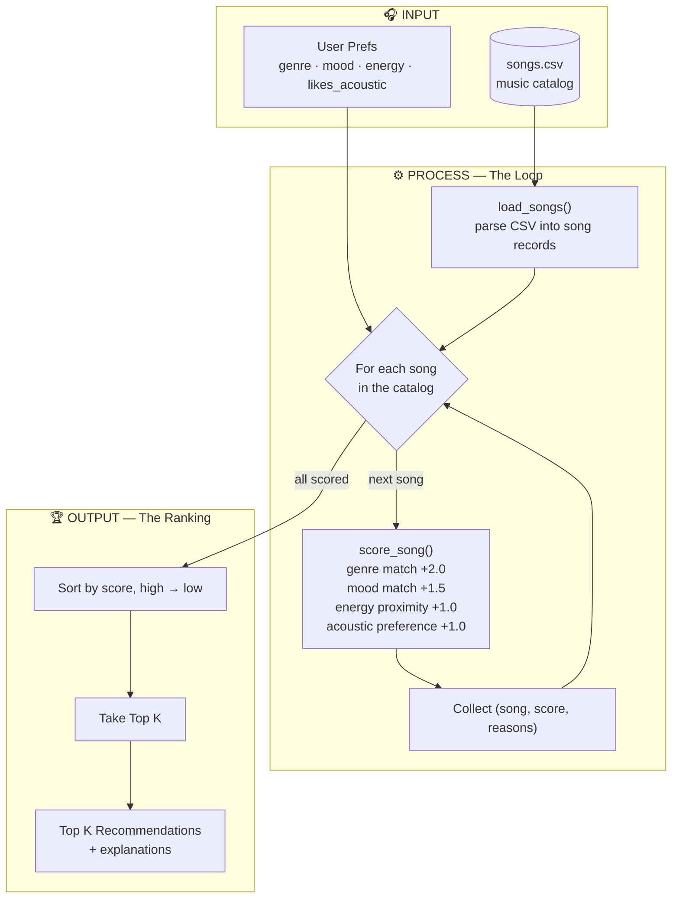

# 🎵 Music Recommender Simulation

## Project Summary

In this project you will build and explain a small music recommender system.

Your goal is to:

- Represent songs and a user "taste profile" as data
- Design a scoring rule that turns that data into recommendations
- Evaluate what your system gets right and wrong
- Reflect on how this mirrors real world AI recommenders

### How Real-World Recommendations Work

Real-world streaming platforms like Spotify and YouTube predict what you will enjoy next by blending two main techniques into a **hybrid system**:

- **Collaborative filtering** learns from other users' behavior — if people with similar tastes love a song, it recommends that song to you.
- **Content-based filtering** looks at the attributes of the songs themselves and finds more that match what you already like.

For this simulation, I will prioritize **content-based filtering**, because it works from a song's own features without needing a large crowd of users, it solves the "cold-start" problem for brand-new songs, and it produces recommendations that are easy to explain.

### Features Used in the Simulation

Each feature in the `UserProfile` is matched against the corresponding feature in the `Song`:

| `Song` feature | `UserProfile` feature | Type |
| --- | --- | --- |
| `genre` | `favorite_genre` | categorical (exact match) |
| `mood` | `favorite_mood` | categorical (exact match) |
| `energy` | `target_energy` | numeric 0–1 (proximity: closer = higher) |
| `acousticness` | `likes_acoustic` | numeric 0–1 vs. boolean preference |

---

## How The System Works

This is a **content-based** recommender. It compares the features of each song
against a user's taste profile, gives every song a score, and returns the
best-matching songs. It never needs other users' data, so it works even on a
brand-new catalog.

### Data Flow



- **Input** — the user's taste profile plus the raw `songs.csv` catalog.
- **Process (the loop)** — every song is scored individually against the profile
  using the four weighted rules, and each result is kept along with its score and
  reasons.
- **Output (the ranking)** — all scored songs are sorted highest-first and the
  top `K` are returned with explanations.

### Design Questions

**What features does each `Song` use in your system?**

- `genre` — style of music (categorical, e.g. pop, lofi, metal)
- `mood` — emotional feel (categorical, e.g. happy, chill, intense)
- `energy` — how intense/active the track is (numeric 0–1)
- `acousticness` — how acoustic vs. produced/electronic it is (numeric 0–1)
- (Also stored but not scored: `tempo_bpm`, `valence`, `danceability`, plus
  `id`, `title`, `artist`.)

**What information does your `UserProfile` store?**

- `favorite_genre` — the genre the user wants (matched to `Song.genre`)
- `favorite_mood` — the mood the user wants (matched to `Song.mood`)
- `target_energy` — the ideal energy level 0–1 (compared to `Song.energy`)
- `likes_acoustic` — a boolean preference for acoustic vs. produced music
  (compared to `Song.acousticness`)

**How does your `Recommender` compute a score for each song?**

- It adds up points from four rules: `score = genre + mood + energy + acoustic`
- **Genre match** — `+2.0` if the song's genre equals the user's favorite, else `0`
- **Mood match** — `+1.5` if the song's mood equals the user's favorite, else `0`
- **Energy proximity** — `+1.0 × (1 − |song.energy − target_energy|)`, so closer is
  worth more (an exact match earns the full point)
- **Acoustic preference** — if `likes_acoustic` is `True`, `+1.0 × acousticness`;
  if `False`, `+1.0 × (1 − acousticness)`
- Genre carries the most weight because it's the strongest signal of taste; the
  weights (`2.0 / 1.5 / 1.0 / 1.0`) are knobs you can tune (see *Experiments*).

**How do you choose which songs to recommend?**

- Score every song in the catalog, then sort by score from highest to lowest
- Return the top `K` (default `K = 5`)
- Each recommendation carries the reasons that earned its points, so the output is
  easy to explain

---

## Getting Started

### Setup

1. Create a virtual environment (optional but recommended):

   ```bash
   python -m venv .venv
   source .venv/bin/activate      # Mac or Linux
   .venv\Scripts\activate         # Windows

2. Install dependencies

```bash
pip install -r requirements.txt
```

3. Run the app:

```bash
python -m src.main
```

### Running Tests

Run the starter tests with:

```bash
pytest
```

You can add more tests in `tests/test_recommender.py`.

---

## Sample Recommendation Output

Paste a sample of your recommender's output here as a text block so a reader can see what it produces:

User profile: `genre=pop, mood=happy, energy=0.8, likes_acoustic=False`

```
Loading songs from data/songs.csv...
Loaded 18 songs.

============================================
  TOP RECOMMENDATIONS
============================================

1. Sunrise City — Neon Echo
   Score: 5.30
   Why:
     • matches your favorite genre (pop)
     • matches your mood (happy)
     • energy 0.82 vs target 0.80
     • produced sound (acousticness 0.18)

2. Gym Hero — Max Pulse
   Score: 3.82
   Why:
     • matches your favorite genre (pop)
     • energy 0.93 vs target 0.80
     • produced sound (acousticness 0.05)

3. Rooftop Lights — Indigo Parade
   Score: 3.11
   Why:
     • matches your mood (happy)
     • energy 0.76 vs target 0.80
     • produced sound (acousticness 0.35)

4. Concrete Kings — Rhyme Theory
   Score: 1.88
   Why:
     • energy 0.80 vs target 0.80
     • produced sound (acousticness 0.12)

5. Warehouse Pulse — Bassline Foundry
   Score: 1.82
   Why:
     • energy 0.95 vs target 0.80
     • produced sound (acousticness 0.03)
```

**Screenshot or video** *(optional)*: <!-- Insert a screenshot or demo video link here -->

---

## Experiments You Tried

Use this section to document the experiments you ran. For example:

- What happened when you changed the weight on genre from 2.0 to 0.5
- What happened when you added tempo or valence to the score
- How did your system behave for different types of users

---

## Limitations and Risks

Summarize some limitations of your recommender.

Examples:

- It only works on a tiny catalog
- It does not understand lyrics or language
- It might over favor one genre or mood

You will go deeper on this in your model card.

---

## Reflection

Read and complete `model_card.md`:

[**Model Card**](model_card.md)

Write 1 to 2 paragraphs here about what you learned:

- about how recommenders turn data into predictions
- about where bias or unfairness could show up in systems like this


